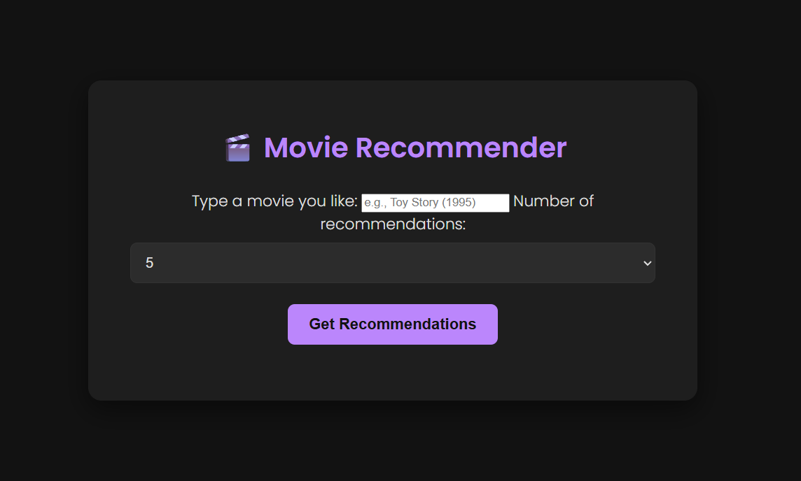
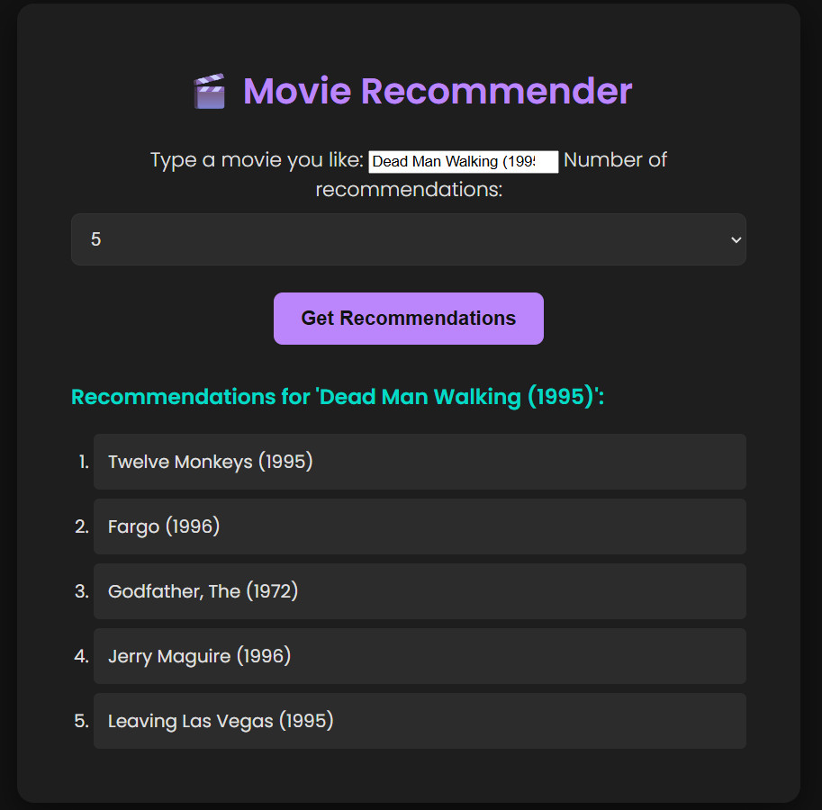

# Movie Recommendation System

A simple **Movie Recommendation System** built using the **MovieLens 100K dataset**.
It uses **Collaborative Filtering with Cosine Similarity** to recommend movies, and is deployed as a lightweight **Flask web app** with a search box interface.

---

## 📌 Features

* Hybrid recommendation using **user–movie rating matrix** and **cosine similarity**.
* **Web-based UI** built with Flask (search box to enter movie names).
* **API endpoint** (`/recommend`) that returns recommendations in JSON.
* Fast response: \~0.2s/query.
* Built as a **resume project for Data Science / AI fresher roles**.

---

## 📂 Project Structure

```
movie-recommender/
│── ml-100k/                  # MovieLens dataset (u.data, u.item)
│── movie.py                  # Main application file
│── screenshots/              # Folder for screenshots
│    ├── homepage.png
│    ├── recommendations.png
│── README.md                 # Project documentation
│── requirements.txt           # Python dependencies
```

---

## ⚙️ Installation & Setup

### 1️⃣ Clone the repository

```bash
git clone https://github.com/your-username/movie-recommender.git
cd movie-recommender
```

### 2️⃣ Create a virtual environment (optional but recommended)

```bash
conda create -n movie-recommender python=3.10 -y
conda activate movie-recommender
```

(or use `python -m venv venv`)

### 3️⃣ Install dependencies

```bash
pip install -r requirements.txt
```

### 4️⃣ Download MovieLens Dataset

* Download from: [MovieLens 100K Dataset](https://grouplens.org/datasets/movielens/100k/)
* Extract inside the project folder as `ml-100k/`

### 5️⃣ Run the application

```bash
python movie.py
```

Visit the app at:
👉 [http://127.0.0.1:5000/](http://127.0.0.1:5000/)

---

## 🖼️ Screenshots

### 🔹 Homepage



### 🔹 Recommendations Page



---

## 🎯 Example Usage

* Open the homepage → enter a movie name like **Toy Story (1995)**.
* Get recommendations like:

  ```
  Star Wars (1977)  
  Rock, The (1996)  
  Independence Day (ID4) (1996)  
  Return of the Jedi (1983)  
  Mission: Impossible (1996)  
  ```

Or, using API directly:

```
http://127.0.0.1:5000/recommend?movie=Toy%20Story%20(1995)
```

returns JSON:

```json
{
  "recommendations": [
    "Star Wars (1977)",
    "Rock, The (1996)",
    "Independence Day (ID4) (1996)",
    "Return of the Jedi (1983)",
    "Mission: Impossible (1996)"
  ]
}
```

---

## 📊 Tech Stack

* **Python** (Pandas, Scikit-learn)
* **Flask** (Web App & API)
* **MovieLens 100K Dataset**
* **HTML (basic UI)**

---

## 📌 Future Improvements

* Add **Bootstrap UI** for a modern look.
* Deploy on **Heroku/Render** for live demo.
* Try **Matrix Factorization (SVD)** for better accuracy.
* Add user login & personalization.

---

## 👨‍💻 Author

**Aditya Raj**

* B.Tech ECE (Final Year) | Aspiring Data Scientist & ML Engineer
* [LinkedIn](https://linkedin.com/in/aditya-rajj/)

---


